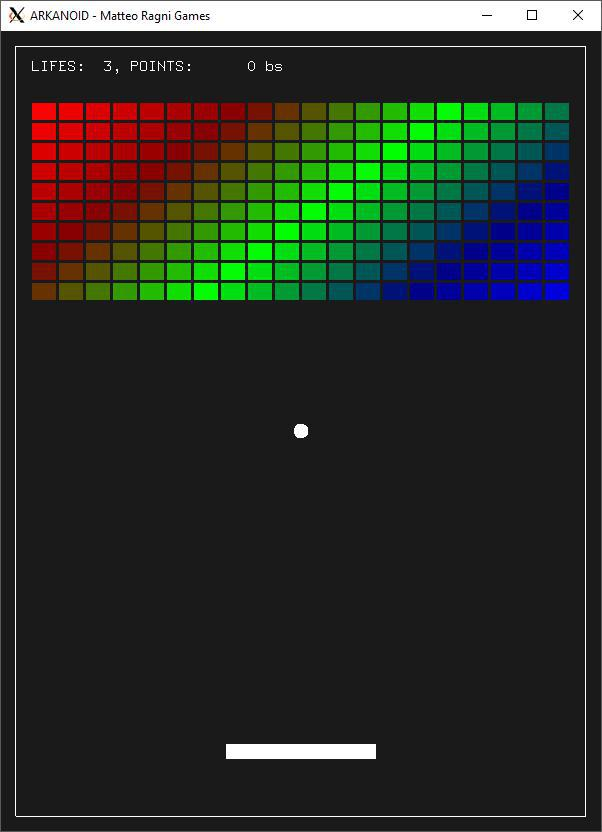

# Arkanoid

```
   _       _                 _    _
  /_\  _ _| |____ _ _ _  ___(_)__| |
 / _ \| '_| / / _` | ' \/ _ \ / _` |
/_/ \_\_| |_\_\__,_|_||_\___/_\__,_|

```

A C implementation of the Arkanoid game, just for fun.



### How to play

Launch the `arkanoid` binary. The keybindings are:

 * <kbd>←</kbd> move the bar to the left
 * <kbd>→</kbd> move the bar to the right
 * <kbd>Left Ctrl</kbd> start and pause the ball
 * <kbd>Esc</kbd> reset the game

### Compile

The game has been written for Linux, and requires:

 * `freeglut3-dev`
 * `libglfw-dev`

To compile the game simply use `make`:

```
make
```